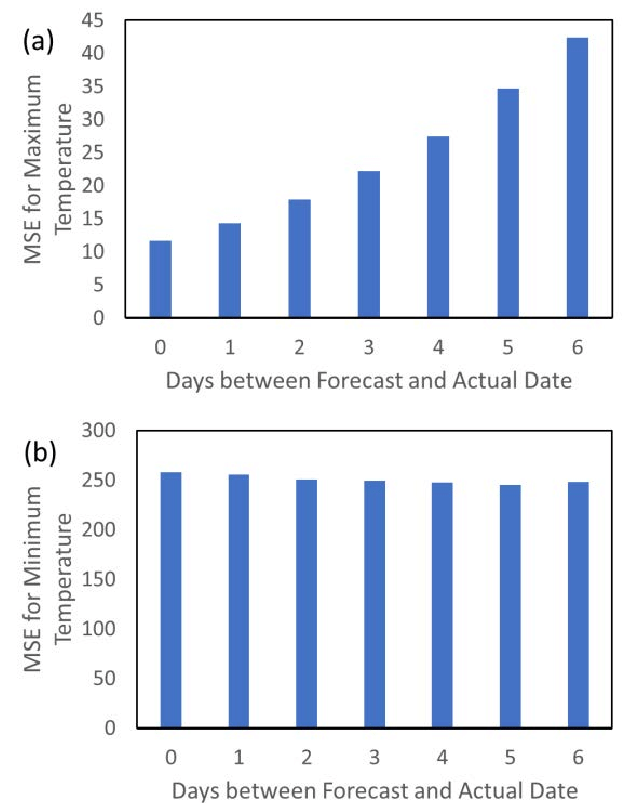

# Shared Task #2 - Temperaturvorhersage

Es soll ein Rekurrentes Neuronales Netz zur Vorhersage der Temperaturen der
nächsten 7 Tage entwickelt werden. Der dafür verfügbare
Datensatz wurde in einer unbekannten Stadt der nördlichen Hemisphäre auf dem
Planeten Erde gesammelt. Es stehen Messungen für mehrere Dekaden zur Verfügung,
die fehlenden Abschnitte zwischen den Sequenzen werden für die Evaluation
genutzt.

## Daten

Es werden folgende Dateien zur Verfügung gestellt:

### Training

- train.csv: Enthält ca. 10 Jahre umfassende Temperatursequenzen, welche für
  das Modelltraining genutzt werden können. Zwischen den Sequenzen gibt es
  zeitliche Lücken, sodass die Sequenzen nicht aneinandergereiht werden können.
  Die Ordnung der Sequenzen ist zufällig.
- sampleTest.csv: Beispieldatei im Format der Testdaten, welche in der
  Evaluationsphase verarbeitet werden sollen
- sampleSubmission.csv: Beispieldatei im Format der erwarteten Submission

### Evaluation

- test_x.csv: Enthält Sequenzen bestehend aus den Temperaturdaten von 90
  aufeinanderfolgenden Tagen.
- test_y.csv: Enthält die korrekten Temperaturangaben der folgenden 7 Tage für
  jede Testsequenz (wird nach dem Ende der Evaluationsphase veröffentlicht).

## Evaluationsmetrik

Die Bewertung erfolgt durch die Metrik "Mean Squared Error".

Für dieses Dataset existiert kein sota. Eine nicht näher bezeichnete Testperson
hat durch ein ca. 30-minütiges Modelltraining (mit GPU) einen MSE von knapp 10
auf den Testdaten erreicht.

Generell steigt der Fehler mit dem Abstand des vorherzusagenden Tageswertes.

Quelle: Sheth, Manasi & Gundreddy, Mahalaxmi & Shah, Vivek & Suess, Eric. (
2018). Spatial and Temporal Trends in Weather Forecasting and Improving
Predictions with ARIMA Modeling.

## Important Dates

| Event                   | Date       |
|-------------------------|------------|
| Task Announcement       | 20.10.2022 |
| Training Data Release   | 20.10.2022 |
| Evaluation Data Release | 27.10.2022 |
| Submission Deadline     | 28.10.2022 |

## Allgemeine Submission Guidelines

Alle Studierenden sollen jeweils einzeln eine Lösung über Moodle einreichen.
Bewertungsrelevant ist das Evaluationsergebnis
bezüglich der definierten Metrik (unter Vorbehalt). Zusätzlich soll der
Quelltext als gitlab-Projekt eingereicht werden,
damit die Erzeugung der Submission nachvollziehbar ist.  
