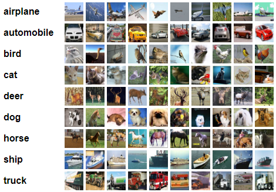

# Shared Task #3 - Image Classification: The Mini9

Es soll ein Neuronales Netz für Bildklassifikation entwickelt werden. Ziel ist es, Minibilder in die 9 Zielkategorien
des Mini9-Datensatzes zu klassifizieren. Der Mini9-Datensatz enthält Bilder der Größe 32*32 Pixel (3 Farbkanäle), welche
mit jeweils einer der 9 Kategorien assoziiert sind.

## Daten

Es werden folgende Dateien zur Verfügung gestellt:

### Training

- train.zip: Enthält je Kategorie einen Ordner, der 5000 Bilder der entsprechenden Kategorie enthält.
- val.zip: Enthält je Kategorie einen Ordner, der 1000 Bilder der entsprechenden Kategorie enthält.
- sampleTest.zip: Beispieldatei im Format der Testdaten, welche in der Evaluationsphase verarbeitet werden sollen.
- sampleSubmission.csv: Beispieldatei im Format der erwarteten Submission. Jede Zeile enthält den Namen der Kategorie
  des entsprechenden Testbildes (diese sind aufsteigend durchnummeriert).

### Evaluation

- test.zip: Enthält zu verarbeitende Testbilder, welche aufsteigend nummeriert sind.
- test_y.csv: Enthält die korrekten Kategorien für die Testbilder (wird nach dem Ende der Evaluationsphase
  veröffentlicht).

## Evaluationsmetrik

Die Bewertung erfolgt durch die Metrik "Accuracy".

Für derartige Klassifikationsaufgaben erreichen aktuelle Modelle eine Accuracy von 99.5+ %. Standardmodelle für
Bildklassifikation erreichen ebenfalls sehr gute Ergebnisse im Bereich von 97+ %, wenn zusätzlich Data Augmentation und
weitere Methoden für Regularisierung und Generalisierung eingesetzt werden. Standardmodelle ohne solche Ergänzungen
erreichen auf dem Validation Set ca. 70 % Accuracy und auf dem Test Set ca. 60 %.

## Important Dates

| Event                   | Date       |
|-------------------------|------------|
| Task Announcement       | 03.11.2022 |
| Training Data Release   | 03.11.2022 |
| Evaluation Data Release | 17.11.2022 |
| Submission Deadline     | 18.11.2022 |

## Allgemeine Submission Guidelines

Alle Studierenden sollen jeweils einzeln eine Lösung über Moodle einreichen.
Bewertungsrelevant ist das Evaluationsergebnis
bezüglich der definierten Metrik (unter Vorbehalt). Zusätzlich soll der
Quelltext als gitlab-Projekt eingereicht werden,
damit die Erzeugung der Submission nachvollziehbar ist.  
